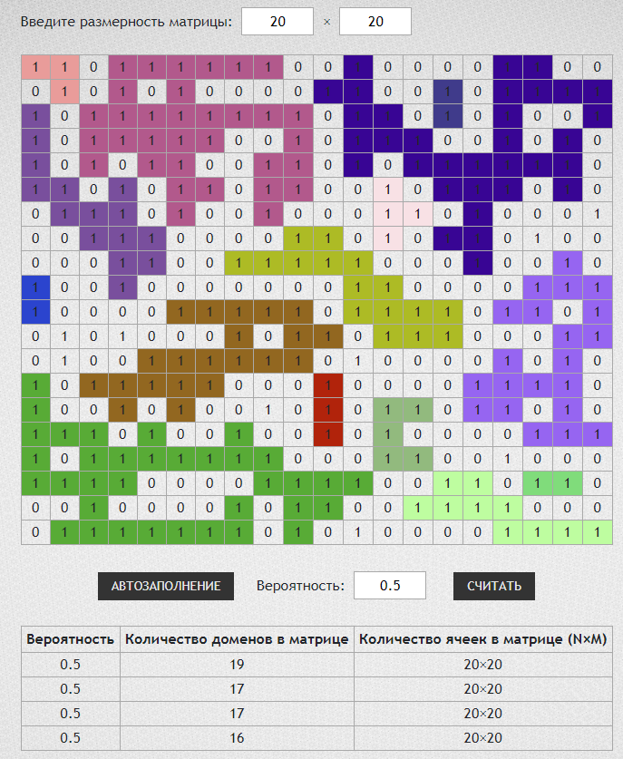

# Testing-Work---AngularJS

## Задание 
Рализуйте при помощи JS, JQuery и AngularJS следующее:  
1). Дана числовая матрица, размеры которой можно будет изменять; 
2). Матрица состоит из 0 и 1 причем поля должны заполняться автоматически (случайно), также следует предусмотреть возможность изменение каждого поля на противоположное значение при клике;  
3). Необходимо предусмотреть вероятность заполнения полей матрицы единицами, которая изменяется от 0 до 1;  
4). В результате следует определить количество отдельно стоящих(не смежных) полей(областей), состоящих только из единиц и закрасить их различными цветами;  
5). В итоговой таблице должно выводиться количество таких областей, текущая размерность матрицы и вероятность заполнения полей матрицы единицами.  

## Ссылка
Работу приложения можно оценить по адресу: <a href="https://rawcdn.githack.com/5-th/Testing-Work---AngularJS/master/index.html"> click me </a>
